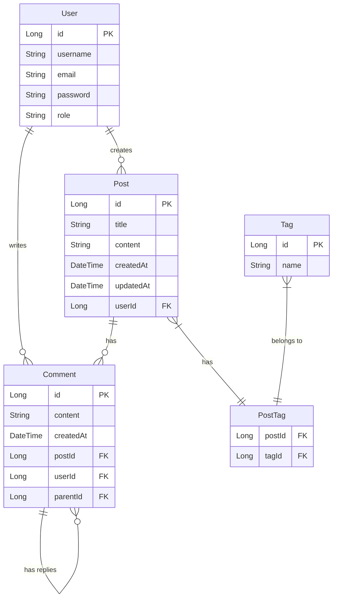

# 🚀 Blog Platform

<div align="center">
  


</div>


## 📝 Description

A robust RESTful Blog Platform built with Spring Boot. This application provides comprehensive APIs to manage blog posts and comments with proper authentication and security mechanisms.

## ✨ Features

- 📃 **Blog Post Management**
  - Create, retrieve, update, and delete posts
  - Pagination and sorting capabilities
  - Search functionality
  
- 💬 **Comment System**
  - Add and retrieve comments on specific posts
  - Nested comments support
  
- 🔒 **Security**
  - JWT-based authentication
  - Role-based authorization
  - Secure API endpoints

- 🛠️ **Additional Features**
  - Exception handling with proper error responses
  - Input validation
  - Logging and monitoring
  - API documentation with Swagger

## 🔧 Technology Stack

<div align="center">
  
| Technology | Description |
|------------|-------------|
|  | Core programming language |
|  | Application framework |
|  | Web framework |
|  | Data persistence |
|  | Authentication & authorization |
|  | Database |
|  | Build tool |
|  | Boilerplate code reducer |
|  | API documentation |

</div>

## 📋 Prerequisites

Before you begin, ensure you have met the following requirements:

- Java 17 or later
- Maven 3.6+
- MySQL database
- Your favorite IDE (IntelliJ IDEA, Eclipse, etc.)

## ⚙️ Installation & Setup

### 1. Clone the repository

```bash
git clone https://github.com/khan-sk-dev/blog-platform.git
cd blog-platform
```

### 2. Configure the database

Create a MySQL database and update the `src/main/resources/application.properties` file:

```properties
spring.datasource.url=jdbc:mysql://localhost:3306/your_database_name
spring.datasource.username=your_username
spring.datasource.password=your_password

# JPA/Hibernate properties
spring.jpa.hibernate.ddl-auto=update
spring.jpa.show-sql=true
spring.jpa.properties.hibernate.format_sql=true
spring.jpa.properties.hibernate.dialect=org.hibernate.dialect.MySQL8Dialect
```

### 3. Build the project

```bash
mvn clean install
```

### 4. Run the application

```bash
mvn spring-boot:run
```

### 5. Access the application

The application will be running at [http://localhost:8080](http://localhost:8080)

Swagger API documentation will be available at [http://localhost:8080/swagger-ui.html](http://localhost:8080/swagger-ui.html)

## 🔌 API Endpoints

### Posts

| Method | Endpoint | Description |
|--------|----------|-------------|
| GET | `/api/posts` | Retrieve all posts (with pagination) |
| GET | `/api/posts/{id}` | Retrieve post by ID |
| POST | `/api/posts` | Create a new post |
| PUT | `/api/posts/{id}` | Update an existing post |
| DELETE | `/api/posts/{id}` | Delete a post |
| GET | `/api/posts/search?keyword=value` | Search posts by keyword |

### Comments

| Method | Endpoint | Description |
|--------|----------|-------------|
| GET | `/api/posts/{postId}/comments` | Retrieve all comments for a post |
| POST | `/api/posts/{postId}/comments` | Add a comment to a post |
| PUT | `/api/comments/{id}` | Update an existing comment |
| DELETE | `/api/comments/{id}` | Delete a comment |

### Authentication

| Method | Endpoint | Description |
|--------|----------|-------------|
| POST | `/api/auth/register` | Register a new user |
| POST | `/api/auth/login` | Login and get JWT token |

## 🔒 Security

- Authentication is handled using JWT (JSON Web Tokens)
- Password encryption using BCrypt
- Role-based authorization (ADMIN, USER)
- CSRF protection and XSS prevention

## 🧪 Testing

The project includes comprehensive tests:

```bash
# Run all tests
mvn test

# Generate test coverage report
mvn jacoco:report
```

Test coverage can be viewed at `target/site/jacoco/index.html`

## 🏗️ Project Structure

```
blog-platform/
├── src/
│   ├── main/
│   │   ├── java/com/khan/blogplatform/
│   │   │   ├── config/
│   │   │   ├── controller/
│   │   │   ├── dto/
│   │   │   ├── exception/
│   │   │   ├── model/
│   │   │   ├── repository/
│   │   │   ├── security/
│   │   │   ├── service/
│   │   │   └── BlogPlatformApplication.java
│   │   └── resources/
│   │       └── application.properties
│   └── test/
│       └── java/com/khan/blogplatform/
│           ├── controller/
│           ├── repository/
│           └── service/
├── .gitignore
├── mvnw
├── mvnw.cmd
├── pom.xml
└── README.md
```

## 📊 Database Schema

<div align="center">
  


</div>

## 🚀 Future Enhancements

- [ ] Add social login integration (Google, GitHub)
- [ ] Implement caching for improved performance
- [ ] Add media upload functionality
- [ ] Create user profiles with additional details
- [ ] Implement blog post categories and tags
- [ ] Add real-time notifications
- [ ] Add analytics dashboard
- [ ] Implement a rate limiter for APIs

## 👥 Contributing

Contributions are what make the open-source community such an amazing place to learn, inspire, and create. Any contributions you make are **greatly appreciated**.

1. Fork the Project
2. Create your Feature Branch (`git checkout -b feature/AmazingFeature`)
3. Commit your Changes (`git commit -m 'Add some AmazingFeature'`)
4. Push to the Branch (`git push origin feature/AmazingFeature`)
5. Open a Pull Request


## 📞 Contact

Khan - [@github_username](https://github.com/khan-sk-dev)

Project Link: [https://github.com/khan-sk-dev/blog-platform](https://github.com/khan-sk-dev/blog-platform)

---

<div align="center">
  
Made with ❤️ by [khan-sk-dev](https://github.com/khan-sk-dev)

</div>
